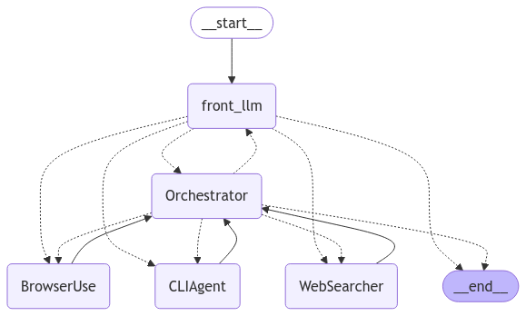

# **Agent Hub: Open-Source Platform for Specialized AI Agents**

Anthropic's Computer Use breakthrough lets AI interact with computers like humans - viewing screens, moving cursors, and typing. While revolutionary, it faces challenges: high latency, significant costs, and reliability issues with specialized tasks.

Our solution: an open-source ecosystem of specialized, lightweight agents instead of a single large model. Each agent masters one task - from spreadsheets to CLI operations. We use both fine-tuned LLMs and clever software solutions, prioritizing efficiency over vision-based interaction.

By making this platform open-source, we're creating a hub where developers can contribute their specialized agents, fostering continuous improvement and evolution. This community-driven approach ensures we're always pushing towards more efficient, reliable, and cost-effective computer automation.

## **Why Morocco?**

When we started this project, we weren't just thinking about building another AI platform - we were thinking about Morocco's unique position in the AI landscape. Our country has untapped tech talent ready to explode, and we believe this is our moment to shine.

Why? Because we're building something that plays to our strengths:

- **Built for Morocco, Open to the World**: We're making it easy to integrate Morocco-specific agents like Darija STT models and Atlas LLM, while keeping the platform globally accessible. It's our way of bringing Moroccan innovation to the world stage.

- **Our Shot at Making History**: Just like GitHub became the hub for code and Hugging Face put France on the AI map, we believe Agent Hub could make Morocco a central player in the AI world. Not by following others' paths, but by creating our own.

This isn't just about catching up - it's about leading in our own way. We're creating a space where Moroccan developers can learn, contribute, and shape the future of AI automation alongside the global community.

> **Project Pitch**: For a comprehensive pitch and overview of Agent Hub's vision and goals, please see our Project Pitch: [Nexus Agents pitch.pdf](./Nexus%20Agents%20pitch.pdf).

[Watch our pitch video](./Pitch%20video.mp4)

## **Table of Contents**
- [Overview](#overview)
- [Features](#features)
- [How It Works](#how-it-works)
- [Project Structure](#project-structure)
- [Contributing](#contributing)
- [Evaluation Pipeline](#evaluation-pipeline)
- [Running the Evaluation Locally](#running-the-evaluation-locally)
- [License](#license)

---

## **Overview**

Agent Hub allows developers to submit specialized AI agents that can interact with computers in various ways. These agents can automate tasks such as:

- Web searches
- Code generation
- Command-line operations
- And more...

Once submitted, agents are automatically evaluated based on defined benchmarks and metrics, including accuracy, speed, memory usage, and robustness. The best-performing agents are showcased in a leaderboard, and the community can vote to highlight the most effective solutions for specific tasks.

---

## **Features**

- **Modular Agent System**: Agents are designed to be specialized for different tasks (e.g., web search, CLI).
- **Automatic Evaluation**: Submitted agents are automatically evaluated on predefined benchmarks.
- **Task-Specific Benchmarks**: Predefined datasets and queries for each agent type.
- **Metrics**: Evaluation based on multiple factors, such as accuracy, time-to-complete, memory footprint, and cost.
- **Open-Source**: Fully open-source and community-driven development.
- **Community Voting (Future)**: Vote for the best agents and help others discover the top performers.
- **Leaderboard (Future)**: A dynamic ranking system for agents based on their evaluation results.

---

## **How It Works**
Agent Hub breaks down complex AI interactions into specialized, efficient agents. Rather than relying on a single large model for all computer interactions, we leverage an ecosystem of purpose-built agents orchestrated by an intelligent planning system.

### Key Benefits
- **Efficiency**: Specialized agents are faster and more resource-efficient than general-purpose models
- **Cost-Effective**: Reduced token usage and computational requirements
- **Reliability**: Purpose-built agents excel at specific tasks
- **Extensible**: Community-driven development of new agents

## **Architecture**

### Solution Architecture


### The Orchestrator

The Orchestrator is our intelligent core that:
1. **Plans**: Breaks tasks into smaller pieces
2. **Coordinates**: Picks and sequences the right agents
3. **Adapts**: Adjusts plans on the fly
Example workflow:
```python
User Query: "Build a React app that displays my photos"

# Orchestrator creates an execution plan:
plan = {
    "tasks": [
        {
            "name": "Code Generation",
            "agent": "CodeGenerator",
            "description": "Create React components for photo display"
        },
        {
            "name": "Project Setup",
            "agent": "CLIAgent",
            "description": "Initialize npm project and install dependencies"
        }
    ]
}
```

### Specialized Agents

Agents are self-contained modules designed for specific tasks:
- **CLI Agents**: Execute terminal commands
- **Code Generators**: Create and modify code
- **Web Agents**: Navigate and interact with websites
- **File System Agents**: Manage files and directories
- **Vision Agents**: Interact with graphical interfaces

Each agent:
- Has a clear, single responsibility
- Implements a standard interface
- Can be simple (function) or complex (containerized service)
- Optimizes for its specific use case

### Graph-based Architecture

Agent Hub leverages the `langgraph` library to wire all components together in a directed graph structure. This architecture provides:

- Clear flow control with defined entry and exit points
- Flexible routing between components
- Conditional execution paths
- State management across the execution chain

The graph structure follows this flow:
1. Entry point (`START`)
2. Front LLM for initial task analysis
3. Orchestrator for task planning and agent selection
4. Specialized agents for task execution
5. Exit point (`END`)

Here's the visual representation of the graph architecture for an example workflow (where the agents used are Browser Agent and CLI Agent):



The graph implementation uses `langgraph`'s `StateGraph` to manage the flow and state transitions between components. Each node in the graph represents an agent or component, and edges define the possible transitions between them based on the execution state.

---

## **Project Structure**

```
agent-hub/
├── .github/
│   └── workflows/
│       └── evaluate-web-search-agent.yml  # Automated evaluation workflow
├── agent_hub/
│   ├── browser/            # Browser interaction agent
│   ├── cli/                # Command-line interface agent
│   ├── coding/             # Code generation agent
│   ├── orchestrator/       # Agent orchestration logic
│   └── web_searcher/       # Web search agent
│       ├── web_searcher.py
│       ├── agent.py
│       ├── front_llm.py
│       ├── graph.py
│       ├── llms.py
│       ├── plan.py
│       └── state.py
├── evaluation/             # Evaluation framework
│   ├── benchmarks_datasets/  # Test datasets for different agent types
│   ├── metrics/             # Performance measurement modules
│   ├── pipelines/          # Evaluation workflow definitions
│   ├── results/            # Evaluation output storage
│   ├── reward_models/      # ML models for output quality assessment
│   └── __init__.py         
├── agent_submission/       # Agent submission handling
├── ci_cd/                  # CI/CD configuration
├── evaluation/             # Evaluation framework
├── requirements/           # Project dependencies
├── scripts/
│   ├── __pycache__/
│   ├── demo_example.py     # Demo script
│   └── run_evaluation.py   # Evaluation runner
└── tests/                  # Test suite
    ├── __pycache__/
    ├── agent_hub/
    └── __init__.py         # Python dependencies
```

---

## **Evaluation Pipeline**

The evaluation pipeline automatically runs on every new agent submission. Here's how it works (see [detailed documentation](/docs/guidelines.md)):

1. **Agent Validation**: The agent is first validated to ensure that it follows the expected format and dependencies.
2. **Benchmark Testing**: The agent is tested against predefined task-specific benchmarks (e.g., web search queries, code generation tasks).
3. **Metrics Collection**: Several metrics are measured, including:
   - **Accuracy**: How well does the agent perform the task?
   - **Time-to-Complete**: How long does it take for the agent to complete the task?
   - **Memory Usage**: How much memory does the agent consume during execution?
   - **Cost**: If applicable, how much does the agent cost to run (e.g., token usage for LLMs)?
4. **Ranking (TODO)**: The agent is ranked based on these metrics, and the results are displayed on the leaderboard.

Note: As detailed in the [available agents](/docs/AGENTS.md), not all agents include evaluation pipelines yet. We're currently working on adding more benchmarks for each agent type.
### **Supported Benchmarks:**
- Web Search Agents
- Browser Agents (Coming Soon)
- CLI Operation Agents (Coming Soon)
- Code Generation Agents (Coming Soon)
- (More benchmarks coming soon...)

---

## **Available Agents**

We've begun populating the hub with our first set of specialized agents! While some are still in development, we're excited to share our progress.

Check out our [Current Agents Overview](docs/AGENTS.md) to:
- See what agents have already landed
- Learn about their capabilities and status
- Discover opportunities for contribution
- Find out which evaluation pipelines are ready

We're just getting started, and we're looking forward to your contributions!

---

## **DEMO**

Below is a demo of a use-case that was solved using Agent Hub:

<video src="https://github.com/user-attachments/assets/92aafa1d-d24c-4411-9379-515a5946e3dd"></video>

---

## **Running the Evaluation Pipeline or Demo Example Locally**

You can run the evaluation pipeline locally to test an agent before submitting it, or try out the demo example. Here's how:

**First make sure your python version is >= 3.11.**

1. Clone the repository:
   ```bash
   git clone https://github.com/Dahimi/Nexus-Agents.git
   cd Nexus-Agents
   ```

2. Create and activate a virtual environment:
   ```bash
   python -m venv venv
   # On Windows
   .\venv\Scripts\activate
   # On Unix or MacOS
   source venv/bin/activate
   ```

3. Install dependencies (update backslahes depending on your OS):
   ```bash
   pip install -r ./requirements/requirements.txt
   ```

4. Install browser-use and playwright:
   ```bash
   playwright install
   ```

5. Set up environment variables (Though it's good software development practice, we uploaded a .env file with the keys to make it easier to run the evaluation pipeline locally (you can use your own keys because those are just free plans keys so they may expire)):
   Create a `.env` file with your API keys:
   ```bash
   SERPER_API_KEY=your_serper_key
   JINA_API_KEY=your_jina_key
   GROQ_API_KEY=your_groq_key
   MISTRAL_API_KEY=your_mistral_key
   ```

6. Run the evaluation or demo:
   For evaluation:
   ```bash
   python scripts/run_evaluation.py
   ```
   For the demo example:
   ```bash
   python -m scripts.demo_example
   ```

5. View results:
   Evaluation results will be saved in `evaluation/results/` with metrics for accuracy, timing, memory usage, etc.


6. Run the Streamlit UI (optional):
   If you prefer a graphical interface, we've created a simple Streamlit app:
   ```bash
   streamlit run .\streamlit_app.py
   ```
   This provides a basic UI for interacting with the agents.


---
## **Contributing**

We welcome contributions in several key areas:

### 1. Building and Submitting Agents

The most direct way to contribute is by creating specialized agents:

1. **Choose a Task**: Identify a specific computer interaction task
2. **Implement the Agent**
3. **Test Locally**: Use our evaluation tools
4. **Submit**: Create a pull request with your agent

#### Agent Requirements
- Clear, single responsibility
- Standard input/output interface
- Documentation and examples
- Passes evaluation metrics

For more details, see [guidelines](/docs/guidelines.md).
### 2. Evaluation Infrastructure

Help us improve how we evaluate and benchmark agents:

- **Benchmark Datasets**: Create or enhance task-specific datasets
- **Evaluation Metrics**: Develop new metrics for agent performance
- **Reward Models**: Build and train models that assess agent outputs
- **Testing Frameworks**: Improve our testing infrastructure

### 3. CI/CD Pipeline

Enhance our automation and deployment infrastructure (It's currently in the very early stages):

- **Submission Pipeline**: Improve agent validation and acceptance
- **Evaluation Pipeline**: Automate performance testing
- **Deployment Flow**: Streamline the process of pushing to the hub
- **Integration Tests**: Add comprehensive testing scenarios

### 4. Documentation and Examples

- Write tutorials and guides
- Create example implementations
- Document best practices
- Translate documentation

### 5. Core Infrastructure

- Improve the Orchestrator's planning capabilities (It's currently in the very early stages)
- Enhance inter-agent communication
- Optimize resource usage
- Add new features to the hub

### Getting Started with Contributing

1. **Fork the repository**
2. **Choose your focus area** from the above categories
3. **Check existing issues** or create a new one describing your planned contribution
4. **Submit a PR** following our contribution guidelines

### Contribution Guidelines

- Follow our coding standards
- Include tests for new features
- Update relevant documentation
- Add your changes to the CHANGELOG


---
### Meet Our Team:

-  [Yassmine ED-DYB](https://www.linkedin.com/in/yassmineeddyb/)
-  [Soufiane DAHIMI](https://www.linkedin.com/in/soufiane-dahimi/)
    
## **License**

This project is licensed under the MIT License - see the [LICENSE](LICENSE) file for details.


