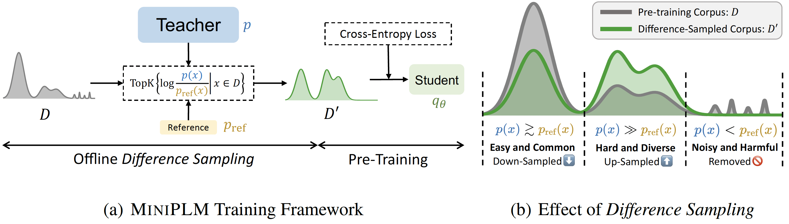
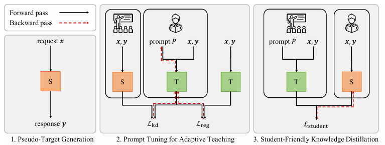

# 🤖 Agent Hub: Current Overview

## Status Indicators

🟢 **Production** - Fully tested, production-ready

🟡 **Beta** - Working implementation, needs refinement

🔴 **Alpha** - Early development stage

## Our Agent Ecosystem

### 🔍 Web Searcher Agent 🟢

Our flagship agent for intelligent web information retrieval.

**Core Features**
- 🎯 Smart query optimization
- 📊 Advanced result ranking
- 🔄 Efficient data filtering

**Implementation Status**

✅ Production-ready evaluation pipeline

✅ Comprehensive benchmarks

✅ CI/CD integration

### 💻 CLI Agent 🟡

Your command-line automation companion, featuring two complementary implementations:

**Standard Version**
- ⚡ Full-featured shell command execution
- 📁 Comprehensive file system operations
- 🛠️ Advanced system management capabilities
- 🧠 Built on established large-scale LLM

**Optimized Version (Our Innovation)**
- 🚀 Significantly faster inference on same hardware
- 💻 Hardware-friendly (20x+ smaller model)
- 🎯 Specialized for CLI operations
- 🔬 Knowledge distillation from larger model
- 🎓 Maintains high command accuracy

**Technical Implementation** 

While we initially explored advanced knowledge distillation approaches (MiniPLM and PromptKD), our implementation adapted to computational constraints:

- 📊 Base Model: Quantized Qwen/Qwen2-0.5B
- 🔧 Optimization: QLoRA fine-tuning using [`train.json`](train.json)
- 💡 Benefits: Reduced memory footprint while maintaining accuracy

Fig 1: MiniPLM's offline difference sampling approach

Fig 2: PromptKD's three-stage distillation process

**Implementation Status**

✅ Core functionality complete in both versions

⏳ Quantization and QLoRA refinements ongoing

🔄 Comparative evaluation pipeline in progress

### 🌐 Web Browser Agent 🔴

Advanced web interaction automation.

**Core Features**
- 🏃‍♂️ Dynamic navigation
- 📝 Form automation
- 🎫 Complex task handling (bookings, registrations)

**Implementation Status**

⚠️ Early prototype

🔄 Stability improvements needed

🤝 Seeking community input

### 👨‍💻 Coder Agent 🔴

Your AI software development companion.

**Core Features**
- 📱 Application development
- 🔧 Code generation & modification
- 🧪 Testing & debugging
- 📚 Documentation generation

**Implementation Status**

⚠️ Early prototype

🔄 Architecture design in progress

🤝 Seeking community input

## 🎯 Supported Task Types

Our platform currently supports these core task types:

1. 🔍 `WEB_SEARCH`
   - Web information retrieval and research
   - Query optimization and filtering
   - Result aggregation and ranking

2. 💻 `CLI_COMMAND` 
   - Command-line operations
   - System management
   - File/directory handling

3. 📂 `FILE_MANIPULATION`
   - File system operations
   - Content reading/writing
   - File organization and management

4. 👨‍💻 `CODER`
   - Code generation and modification
   - Testing and debugging
   - Documentation creation

5. 🎭 `ORCHESTRATOR`
   - Task planning and coordination
   - Workflow management
   - Agent interaction handling

6. 🌐 `WEB_BROWSER`
   - Complex web interactions
   - Form automation
   - Dynamic navigation
